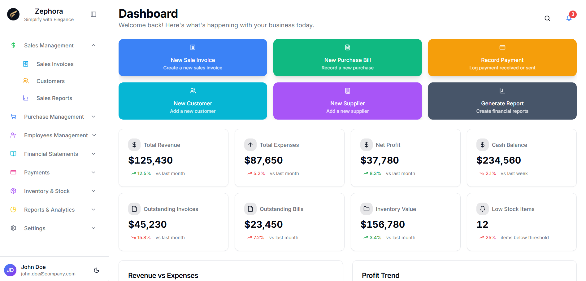
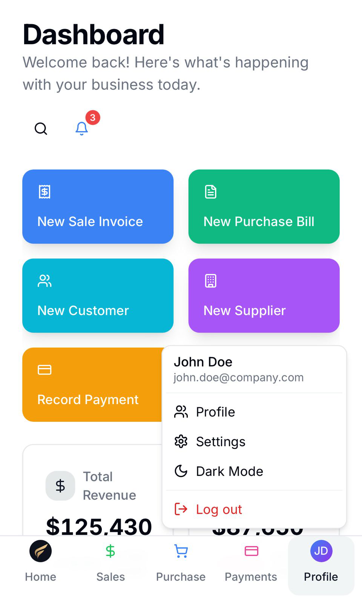

# Zephora


<!--  -->

🔗 **Preview :** [https://zephora-public.lovable.app](https://zephora-public.lovable.app)

Zephora is an open source platform that empowers small businesses and MSME owners to manage their operations and finances seamlessly, all through a clean and modern interface. (To be deleted)  

---

## Features
- 📱 **Responsive Across Desktop & Mobile:** Whether you’re in the office, home or vacation, Zephora works perfectly everywhere.
- 📊 **Live Dashboard:** Instantly visualize your business with dynamic metrics, recent activities, and financial overviews.
- 🧾 **Easy Invoicing & Billing:** Create, send, and manage sales invoices and purchase bills without any hassle.
- 📒 **Unified Directory:** Organize all your customers and suppliers seamlessly.
- 👥 **Employee Hub:** Manage team members and monitor their attendance, payroll and advances(if any) effortlessly.
- 💸 **Smart Payment Tracker:** Track received, due, and overdue payments to always stay on top and updated.
- 📈 **Insightful Reports:** Generate powerful analytics revealing revenue, expenses, and growth trends.
- 🛎️ **Real-Time Alerts:** Receive instant notifications for important business events and overdue actions.
- 🛡️ **Secure & Customizable:** Modern security, robust permissions, and workflow-tailored customization.
- ⚡ **Lightning-Fast Interface:** Enjoy a clean, modern, and elegant user experience.

---

## Getting Started

Get Zephora locally in a few steps:

### Prerequisites

- [Node.js](https://nodejs.org/) (v18 or higher recommended)
- [npm](https://www.npmjs.com/) (comes with Node.js)
- [Git](https://git-scm.com/)

### Installation

1. **Clone the repository**
    ```sh
    git clone https://github.com/Collab-with-Rajibul/zephora-public.git
    ```

2. **Navigate to the project directory**
    ```sh
    cd zephora-public
    ```

3. **Install dependencies**
    ```sh
    npm install
    ```

4. **Start the development server**
    ```sh
    npm run dev
    ```

5. Open [http://localhost:8080](http://localhost:8080) in your browser to see the app locally.

---

## Contributing

We welcome contributions from the community! Whether you want to fix a bug, add a feature, or improve documentation, your input is appreciated.
<!-- 
**How to contribute:**

1. **Fork** the repository.
2. **Create a new branch** for your feature or fix.
    ```sh
    git checkout -b your-feature-name
    ```
3. **Make your changes** and commit them with clear messages.
    ```sh
    git add .
    git commit -m "Describe your changes"
    ```
4. **Push** your branch to your forked repo.
    ```sh
    git push origin your-feature-name
    ```
5. **Open a pull request** to the main repository with a description of your changes.
 -->
Feel free to open issues for help, feature requests, or questions!

---
<!--
## License

This project is open source and available under the [MIT License](LICENSE).

---
-->
## Acknowledgments

- ⚡️ Fast development with [Vite](https://vitejs.dev/)
- 🛠️ Type-safe codebase with [TypeScript](https://www.typescriptlang.org/)
- ⚛️ Built using [React](https://react.dev/)
- 🎨 Beautiful UI with [Tailwind CSS](https://tailwindcss.com/), [shadcn-ui](https://ui.shadcn.com/), and [lucide-react](https://lucide.dev/)
